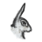
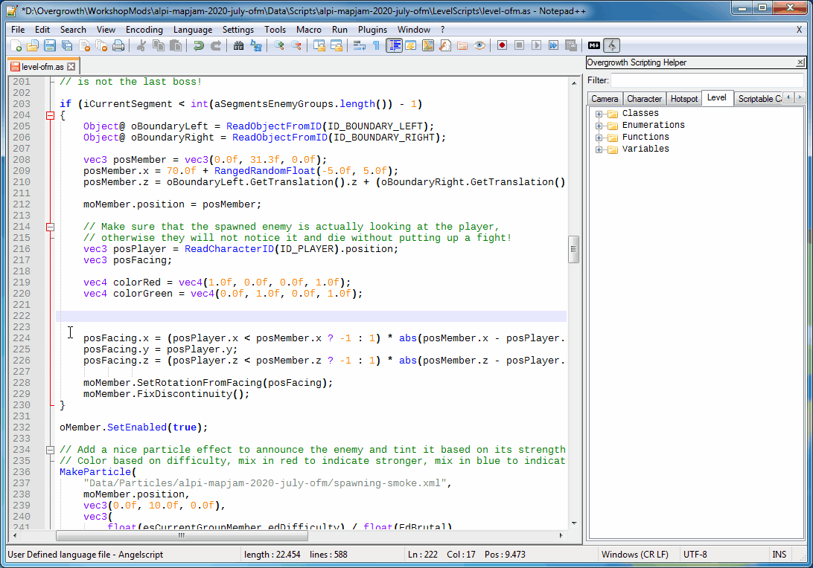
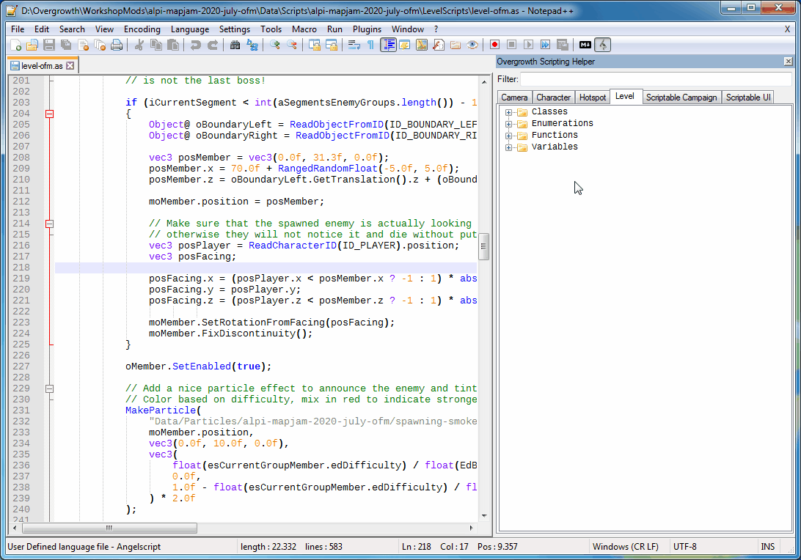
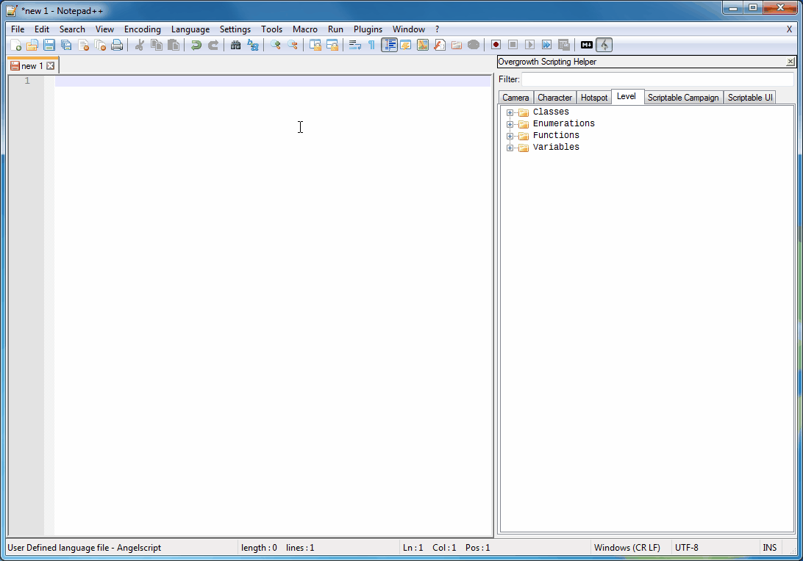

# Overgrowth Scripting Helper
A Notepad++ plugin, calltip and language definitions to enhance scripting for Overgrowth in Angelscript.

## Feature List
- Angelscript Syntax Highlighting extended with Overgrowth Type Support
- Function Calltips for every script type and enabled Angelscript standard library functions
- Customizable Helper Window to browse and filter Classes, Enumerations, Functions and Variables
- Script Templates for Camera, Character, Hotspot and Level scripts
- Cheat Sheet to check root folders for specific paths

## Navigation
1. [Feature List](#feature-list)
2. [Preview](#preview)
3. [Requirements](#requirements)
4. [Installation Guide](#installation-guide)
5. [Troubleshooting & FAQ](#troubleshooting-and-faq)
6. [Developing](#developing)
7. [Stuff for the future](#stuff-for-the-future)
8. [Known Bugs](#known-bugs)
9. [Licensing and Credits](#licensing-and-credits)

## Preview
Check parameters of function overloads with the Notepad++ calltips for the available Overgrowth and Angelscript standard library functions.

  

Browse through all available classes, enumerations, functions and variables.

  

Start off new scripts with a template and have every script function ready to go.

## Requirements
- .NET Framework 4 (comes preinstalled on Windows 10)
- Notepad++ 32 bit or 64 bit
- Windows

## Installation Guide
> All steps can be also reproduced on the portable version of Notepad++
1. Download the <a href="https://github.com/alpyen/Overgrowth-Scripting-Helper/releases">latest release</a> which matches your Notepad++ installation (32 bit or 64 bit)
2. Extract the archive and merge the `autoComplete` and the `plugins` folders into the root folder of your Notepad++ installation in Program Files.
3. Start Notepad++ and a rabbit icon should appear in the toolbar.
4. Open the folder for the user defined languages by navigating through the menu  `Language > User Defined Language > Open User Defined Language folder...`
5. Copy the `Angelscript UDL.xml` file into the folder and restart Notepad++.
6. That's it, enjoy!

## Troubleshooting & FAQ
- *Notepad++ shows the error "Cannot load 32-bit plugin." on startup*
  - It seems like you downloaded the wrong version of the plugin. Run Notepad++ and check the version through the menu `? > About Notepad++`. You have to download exactly the same version as the application regardless of your operating system.  
- *The syntax highlighting is incorrect, it uses ActionScript*
  - This can happen the first time you're launching Notepad++ with the new language definition and had already an \*.as file open. Just switch once to Angelscript by selecting it in the language menu. It shouldn't happen again, if it does you can disable ActionScript in the settings.  
- *Notepad++ takes ages to start after installing the plugin*
  - This is because the plugin has to load and parse the database file. Since the file is almost 2 MB it might take a second or two on startup.

## Developing
The project consists of two solutions: `AsDocs2XML` and `Overgrowth Scripting Helper`.

**AsDocs2XML** is used to parse the header files the game outputs into the XML file format so the plugin can load it.
However the original *_docs.h files are as of right now (Overgrowth 1.4) malformatted and also incorrect which will make them not compliant with the the parser, they'll flat out crash it.

I sanitized and corrected all header files and saved them at `CalltipDefinitions\Overgrowth 1.4`, these files are also references as the command line parameters for the parser.

When successfully built and run, AsDocs2XML will output the Notepad++ calltips file `angelscript.xml` and the database file `database.xml` into `AsDocs2XML\bin`.

**Overgrowth Scripting Helper** is the actual plugin and uses post-build commands to move the two files, mentioned above, into their respective folders.
Since these folders are in Program Files, they might be write protected.

If you don't want to run Visual Studio with elevated privileges
you have the option to either use a portable Notepad++ instance, or set the `autoComplete` and the `plugins` folders (and their subfolders) writable as the user you're logged in as.

This is done to streamline the development process, if you are fine with moving the files manually you can simply disable the post-build commands.
> Note that the language definition `Angelscript UDL.xml` is not moved on build since this files does not change.
> It has to be moved once manually.

When successfully built and run, Notepad++ should start with the plugin enabled and ready to test.
> Changes made in the settings will remain because the config file stored in AppData will not be deleted.

## Stuff for the future
#### Helper Window
- Save the steps while filtering so the tree view can be rebuilt faster
- Nightmode

#### Settings
- Set Cheat Sheet and Helper Window OnToppable

#### Plugins Menu
- Script Templates for `Scriptable Campaign` and `Scriptable UI`

## Known Bugs
- Notepad++ shows the wrong calltip if previously a calltip with the same prefix has been opened:
  - Open DebugDrawLine, try to open DebugDrawLines, it will still show DebugDrawLine.

## Licensing and Credits
Overgrowth Scripting Helper is released under the MIT license.

This project includes various other projects which made this project possible in the first place. Thanks to:

- The rabbit icon has been taken off the Overgrowth game files created by <a href="https://www.wolfire.com/">Wolfire Games</a>.
- The Notepad++ plugin base <a href="https://github.com/kbilsted/NotepadPlusPlusPluginPack.Net">NotepadPlusPlusPluginPack.Net</a> version 0.95.00 was developed by kbilsted and provided under the Apache-2.0 license.
- Some icons have been used and modified from the <a href="https://www.famfamfam.com/lab/icons/silk/">Silk Icon Set 1.3</a> by Mark James and provided under the CC-BY-2.5 license.